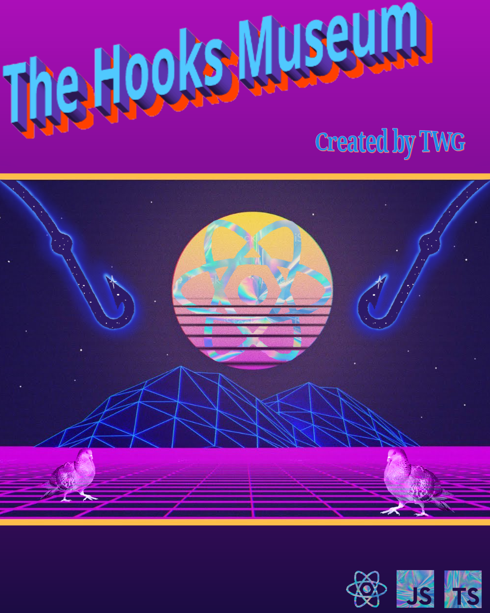

# 🏛 React Hooks Museum 🏛

Useful React & React-Native hooks snippets. Get inspired \
Don't think of it as a hook library but as inspiration.

## 📂 The repository contains three directories:

| Folder                                                                                        | Description                                            |
| --------------------------------------------------------------------------------------------- | ------------------------------------------------------ |
| **[React](https://codesandbox.io/s/react-hooks-museum-7kkbl)**                                | includes Hooks, only usable in react-web               |
| **react-native**                                                                              | includes Hooks, only usable in react-native            |
| **[react_and_react-native](https://codesandbox.io/s/reactandreactnative-hooks-museum-6ll3c)** | includes Hooks, to be used on react-web & react-native |

## 🖥 Access via codesandbox:

- **[React](https://codesandbox.io/s/react-hooks-museum-7kkbl)**
- **[React & React-Native](https://codesandbox.io/s/reactandreactnative-hooks-museum-6ll3c)**

## 🗓 Future plans

- Add more hooks 🔥
- Add tests for every hooks
- Add playground for react-native hooks
- Add script to generate snippet for VS Code and Webstorm

## ⚖️ License

**[MIT](/LICENSE)**
